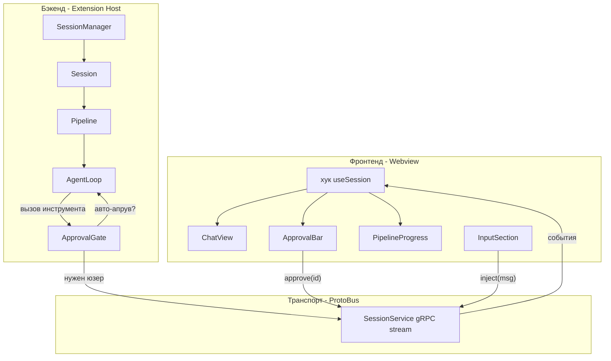

# Chat Pipeline Architecture

Источник: архитектурный план (chat pipeline)

## Проблема

Текущая архитектура

- `task.ask()` блокирует через `pWaitFor` (поллит переменную каждые 100мс)
- Один `controller.task` -- одна задача одновременно
- `cancelTask` = уничтожить + пересоздать из истории
- `postStateToWebview()` сливает весь state (все сообщения) при каждом изменении
- Фронтенд угадывает статус AI по типам сообщений (эвристика `isAiWorking`)
- `buttonConfig.ts` выводит кнопки из типа последнего сообщения -- хрупкий автомат

## Целевая архитектура



## Основные абстракции

### 1. Session (заменяет Task)

Одна единица разговора. Независимый state. Готова для табов с первого дня.

```typescript
class Session extends EventEmitter<SessionEvent> {
  id: string
  state: "idle" | "running" | "paused" | "done" | "error"
  messages: ShuncodeMessage[]
  pipeline: Pipeline
  approvalGate: ApprovalGate

  inject(msg: UserMessage): void
  abort(): void
  pause(): void
  resume(): void
}
```

Ключевое отличие от Task: `inject()` никогда не блокирует, не падает, не требует маршрутизации. Если pipeline работает -- сообщение в очередь сессии. Если idle -- запускается новая итерация pipeline.

### 2. Pipeline (заменяет agent loop в task/index.ts)

Типизированные шаги исполнения с прогрессом:

```typescript
type PipelineStage =
  | "preparing"
  | "calling_api"
  | "streaming"
  | "tool_execution"
  | "awaiting_approval"
  | "completed"

class Pipeline {
  stages: PipelineStage[]
  currentStage: PipelineStage
  progress: number

  async run(context: PipelineContext): AsyncGenerator<PipelineEvent>
}
```

### 3. ApprovalGate (заменяет pWaitFor + askResponse)

На Promise, без поллинга:

```typescript
class ApprovalGate {
  private pending: Map<string, PromiseResolver<ApprovalResult>>
  private rules: AutoApproveRules

  async check(tool: ToolRequest): Promise<ApprovalResult> {
    if (this.rules.shouldAutoApprove(tool)) {
      return { approved: true }
    }

    const id = generateId()
    return new Promise((resolve) => {
      this.pending.set(id, resolve)
      this.session.emit("approval_needed", { id, tool })
    })
  }

  resolve(id: string, approved: boolean, feedback?: string): void {
    const resolver = this.pending.get(id)
    if (resolver) {
      this.pending.delete(id)
      resolver({ approved, feedback })
    }
  }
}
```

### 4. SessionManager (заменяет controller.task)

```typescript
class SessionManager {
  sessions: Map<string, Session>
  activeSessionId: string | null

  create(): Session
  get(id: string): Session
  switchTo(id: string): void
  get currentSession(): Session | null
}
```

Одна сессия сейчас. Добавление табов -- задача UI, не смена архитектуры.

## Изменения транспорта

### Новый proto: `session.proto`

```proto
service SessionService {
  rpc createSession(CreateSessionRequest) returns (SessionInfo);
  rpc sendMessage(SendMessageRequest) returns (Empty);
  rpc respondToApproval(ApprovalResponse) returns (Empty);
  rpc abortSession(StringRequest) returns (Empty);
  rpc pauseSession(StringRequest) returns (Empty);
  rpc resumeSession(StringRequest) returns (Empty);
  rpc subscribeToSession(StringRequest) returns (stream SessionEvent);
}
```

Ключевое изменение: вместо дампа всего `ExtensionState.shuncodeMessages[]` на каждый `postStateToWebview()`, использовать инкрементальные `SessionEvent`.

## Что удаляется из старого контура

- `task.ask()` + `pWaitFor`
- `handleWebviewAskResponse()` и `taskState.askResponse`
- старый `TaskServiceClient.askResponse()`
- `postStateToWebview()` для доставки сообщений
- эвристика `isAiWorking` и `buttonConfig.ts`
- `useMessageQueue` и сложная маршрутизация отправки

## Изменения фронтенда

### Новый хук: `useSession`

- подписка на `SessionService.subscribeToSession`
- хранение `state`, `messages`, `progress`, `approvals`
- методы `inject`, `approve`, `reject`, `abort`, `pause`, `resume`

### Упрощение ChatView

- `InputSection` всегда вызывает `inject()`
- approval UI строится из `pending approvals`
- прогресс рендерится из событий pipeline
- удаляются `useMessageQueue.ts` и `buttonConfig.ts`

## Порядок реализации

| # | Задача | Статус |
|---|--------|--------|
| 1 | Session + SessionManager | ✅ Реализовано |
| 2 | ApprovalGate вместо `pWaitFor` | ✅ Реализовано |
| 3 | Pipeline + события прогресса | ✅ Реализовано |
| 4 | `SessionEvent` stream вместо full-state push | ✅ Реализовано |
| 5 | Переписанный frontend (`useSession`, новый approval flow) | ⚠️ Частично — `useSession.ts` и `ApprovalBar.tsx` созданы, но старый `ChatView` ещё активен |
| 6 | Уборка legacy-кода (`task.ask()`, `pWaitFor`, poll-подход) | ❌ Не начато — `pWaitFor` и `askResponse` всё ещё используются в `Task` |

> **Примечание:** Новая архитектура работает параллельно со старой. `task.ask()` и `pWaitFor` всё ещё используются в `src/core/task/index.ts`. Chat UI переведён на `TurnBlock` архитектуру (sticky headers, CSS-based scroll) но пока поверх старого transport. Полная миграция запланирована.

